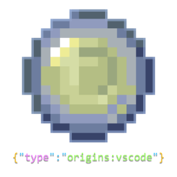

    <picture>
        
    </picture>
    <ul style="list-style: none;">
        

            <h1>Origins VSCode Extension</h1>
        

    </ul>
    

      JSON Schemas for <a href="https://www.curseforge.com/minecraft/mc-mods/origins">Origins</a> JSON files in Visual Studio Code.
    

---

## ✨ Features

- Autocomplete for all Origins mod JSON files.
- Autocomplete for vanilla identifiers, like items, blocks and entity types.
- Full descriptions for all JSON fields.
- Support for the following Origins Addons:
  - [Apugli](https://apugli.readthedocs.io/en/latest/)
  - [Epoli](https://epoli-docs.readthedocs.io/en/latest/)
  - [Extra Origins](https://github.com/MoriyaShiine/extra-origins/wiki)
  - [Mob Origins](https://moborigins.ultrusmods.me/en/latest/)
  - [Origins Extra Keybinds](https://www.curseforge.com/minecraft/mc-mods/origins-extra-keybinds)
  - [Provi's Origins](https://github.com/Provismet/Provi-Origins/wiki)
  - [Skillful](https://skillful-docs.readthedocs.io/en/latest/)

_This extension uses Schemas from [Origins Mod JSON Schemas](https://github.com/SnaveSutit/origins-mod-json-schemas) repository._

> [!IMPORTANT] Supported Versions
> This extension officially supports the latest version of Origins. If you are using an older version, some features may not work as expected.
>
> However, most features should still work as expected.
>
> Support for older versions of Origins will be added in the future!

### 🐛 Report any issues you find on our [Github](https://github.com/SnaveSutit/origins-mod-vscode-extension/issues/)!

It only takes a few minutes of your time, and helps improves the tool for everyone!

### 🌟 If you like this extension, please consider giving it a star on [GitHub](https://github.com/SnaveSutit/origins-mod-vscode-extension).

It lets know that people really enjoy using it, and gives me motivation to keep improving it! ❤️
